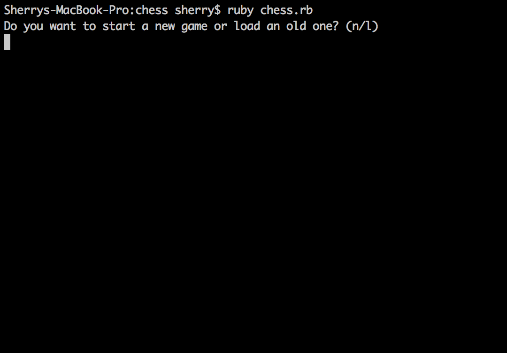
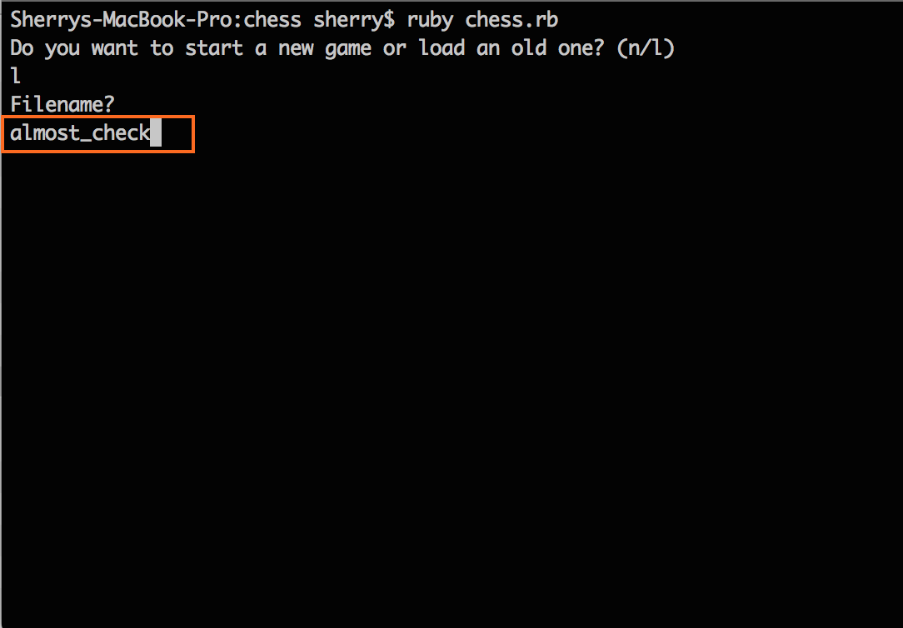
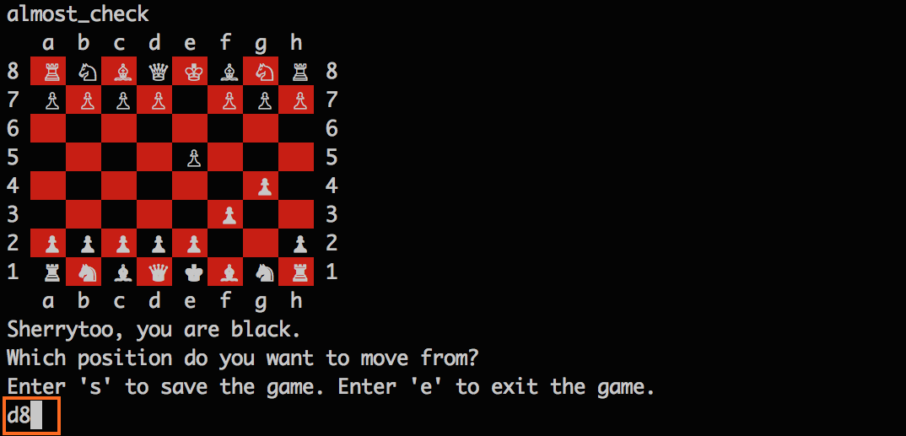
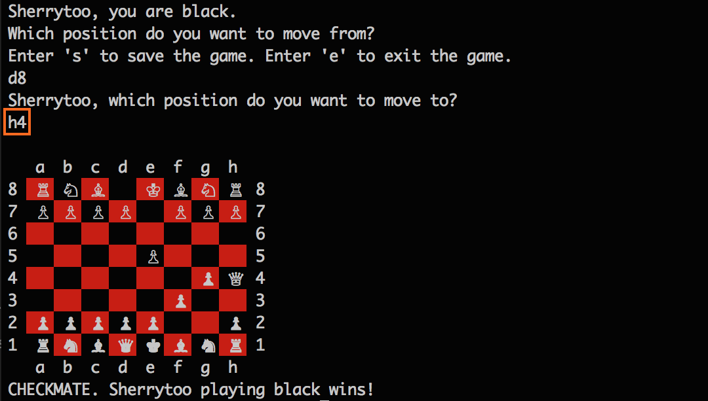

# App Academy Projects
====================
This was partially completed with [Varun](https://github.com/varunprabhakar14). See my related blog post [here](http://blog.cssherry.com/post/105412733689/w2d2-class-inheritance-and-the-tale-of-iteration) and [here](http://blog.cssherry.com/post/105499834509/w2d3-chess-completed).

## Week 2
### W2D2 and W2D3
* Class inheritance
* Exceptions, error handling
* Decomposition into objects
* Inheritance, Polymorphism and DRY
* Information hiding/encapsulation

# How to Run These Files
These files require Ruby to run. The best tutorial I've found is this: [Ruby Installation Tutorial](http://installrails.com/steps)

Once Ruby is installed, bundle install, download the files, go into terminal, and either run the game interface

$ ruby chess.rb *recommended

or run them through irb

$ irb
$ load 'chess.rb'

## To get started
<ol>
  <li>Download the ruby file <a href="chess.zip">here</a></li>
  <li>Unzip the file</li>
  <li>Navigate to the folder in terminal</li>
  <li>Run the command <code>$ bundle install </code> in the terminal</li>
  <li>
    

      Run the command <code>$ ruby chess.rb </code> to start the game
    

    
  </li>
  <li>
    

      Feel free to try out an existing game <code>$ almost_check </code>
    

    
  </li>
  <li>
    

      If you would like to win, enter <code>8d</code> as the start position and <code>4h</code> as the end position
    

    
    
  </li>
</ol>
